# Computiq Academy — Project Design & Architecture (V1)

> **Version:** 1.0 — MVP Launch  
> **Date:** March 17, 2026  
> **Stack:** Laravel 12 · Filament 4 · React 19 · Tailwind CSS 4 · MySQL · Vite

---

## Table of Contents

1. [Project Overview](#1-project-overview)
2. [Tech Stack](#2-tech-stack)
3. [High-Level Architecture](#3-high-level-architecture)
4. [Role System & Access Control](#4-role-system--access-control)
5. [Database Schema](#5-database-schema)
6. [Core Modules Breakdown](#6-core-modules-breakdown)
7. [Page Map & Routes](#7-page-map--routes)
8. [User Flows](#8-user-flows)
9. [API Structure](#9-api-structure)
10. [Frontend Architecture (React)](#10-frontend-architecture-react)
11. [Admin Panel (Filament)](#11-admin-panel-filament)
12. [Payment & Checkout Architecture](#12-payment--checkout-architecture)
13. [Integrations](#13-integrations)
14. [V1 Task Tracker](#14-v1-task-tracker)
15. [Deferred to V2](#15-deferred-to-v2)

---

## 1. Project Overview

**Computiq Academy** is an e-learning platform for the Iraqi market supporting:

- **Online & on-site** courses and programs
- **Four user roles**: Student, HR, Organization, Admin
- **Role switching** (inspired by [eYouth](https://eyouthlearning.com/en/))
- **Payment & checkout** (online via ZainCash + on-site cash)
- **Talent pool** for HR recruitment
- **Organization dashboards** for universities

### Key Business Goals

| Goal | Description |
|------|-------------|
| **Education** | Online and on-site learning through courses and programs |
| **Employment** | Connect graduates with HR through a talent pool |
| **Partnerships** | Allow universities to track their students |
| **Revenue** | Course/program sales + HR subscription plans |

---

## 2. Tech Stack

### Backend

| Layer | Technology |
|-------|-----------|
| Framework | Laravel 12 |
| Admin Panel | Filament 4 |
| Auth | Laravel Sanctum + Socialite (Google, GitHub) |
| Roles & Permissions | Spatie Laravel Permission |
| Media | Spatie Media Library |
| Payments | ZainCash |
| PDF/Export | DomPDF, Maatwebsite Excel |
| Real-time | Pusher + Laravel Echo |

### Frontend

| Layer | Technology |
|-------|-----------|
| UI Framework | React 19 (TSX) |
| Routing | React Router DOM v7 |
| Styling | Tailwind CSS 4 |
| HTTP | Axios |
| Notifications | React Toastify |
| Icons | Lucide React |
| Build | Vite 7 |

---

## 3. High-Level Architecture

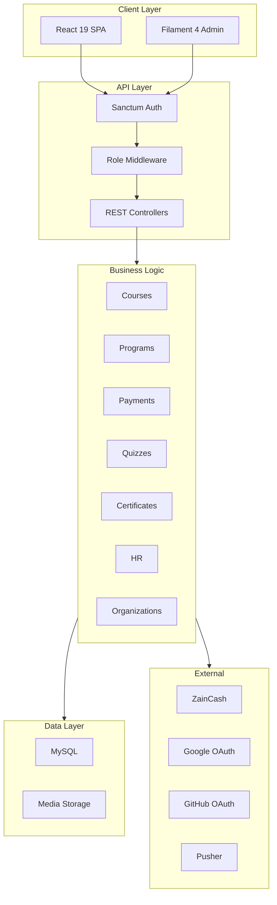

---

## 4. Role System & Access Control

### 4.1 Roles Overview

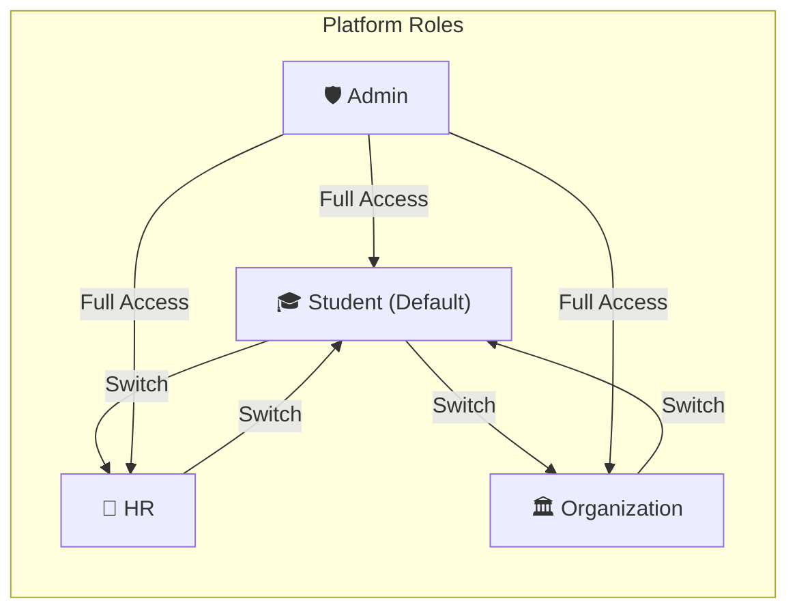

### 4.2 Role Switching

Users can switch roles through a top navigation button. All users default to **Student**. Additional roles (HR, Organization) are unlocked after profile completion.

### 4.3 Permissions Matrix

| Feature | Student | HR | Organization | Admin |
|---------|---------|-----|-------------|-------|
| Browse courses & programs | ✅ | ✅ | ✅ | ✅ |
| Purchase courses/programs | ✅ | — | — | — |
| Access learning content | ✅ | — | — | ✅ |
| Take quizzes | ✅ | — | — | — |
| Earn certificates | ✅ | — | — | — |
| Comment & rate courses | ✅ | — | — | — |
| Post jobs | — | ✅ | — | ✅ |
| Search academy talents | — | ✅ | — | ✅ |
| View student profiles | — | ✅ | — | ✅ |
| View org students & rankings | — | — | ✅ | ✅ |
| Manage all content | — | — | — | ✅ |

---

## 5. Database Schema

### 5.1 ERD

```mermaid
erDiagram
    USERS ||--o{ ENROLLMENTS : "enrolls in"
    USERS ||--o{ PAYMENTS : "makes"
    USERS ||--o{ COMMENTS : "writes"
    USERS ||--o{ CERTIFICATES : "earns"
    USERS ||--o{ QUIZ_ATTEMPTS : "takes"
    USERS ||--o{ CODING_SUBMISSIONS : "submits"
    USERS ||--o{ JOB_APPLICATIONS : "applies to"
    USERS ||--o{ USER_SKILLS : "has"
    USERS }o--o| ORGANIZATIONS : "belongs to"
    USERS }o--o| STUDENT_PROFILES : "has"
    USERS }o--o| HR_PROFILES : "has"

    COURSES ||--o{ LESSONS : "contains"
    COURSES ||--o{ QUIZZES : "includes"
    COURSES ||--o{ CODING_TASKS : "includes"
    COURSES ||--o{ ENROLLMENTS : "has"
    COURSES ||--o{ COMMENTS : "receives"
    COURSES }o--|| INSTRUCTORS : "taught by"
    COURSES }o--o| CATEGORIES : "categorized in"
    COURSES ||--o{ ATTENDANCE_RECORDS : "tracks"

    PROGRAMS ||--o{ PROGRAM_COURSES : "contains"
    PROGRAMS ||--o{ ENROLLMENTS : "has"
    PROGRAMS ||--o{ COMMENTS : "receives"
    PROGRAMS }o--o| CERTIFICATION_PARTNERS : "partnered with"

    QUIZZES ||--o{ QUIZ_QUESTIONS : "contains"
    QUIZ_ATTEMPTS ||--o{ QUIZ_ANSWERS : "contains"

    CODING_TASKS ||--o{ TEST_CASES : "validated by"

    HR_PROFILES ||--o{ JOBS : "posts"
    HR_PROFILES }o--|| HR_PLANS : "subscribed to"
    JOBS ||--o{ JOB_APPLICATIONS : "receives"
```

### 5.2 Tables

#### Users & Auth

| Table | Key Columns |
|-------|-------------|
| `users` | id, name, email, password, avatar, phone, city, country, current_role, google_id, github_id, email_verified_at |
| `student_profiles` | id, user_id, headline, bio, university, department, degree, start_year, graduation_year, cv_path, preferred_role, preferred_city, job_availability, linkedin_url, github_url, portfolio_url, total_score, online_score, onsite_score |
| `hr_profiles` | id, user_id, company_name, company_logo, industry, company_size, description, work_email, phone, website, city, hiring_focus, target_roles, hr_plan_id |
| `organization_profiles` | id, user_id, name, logo, type, city, website, email, contact_person, phone, description, partnership_status |

#### Courses & Programs

| Table | Key Columns |
|-------|-------------|
| `categories` | id, name, slug, icon, parent_id |
| `courses` | id, title, slug, summary, description, what_you_learn, prerequisites, duration, price, type (online/onsite), status (open/closed), instructor_id, category_id, certificate_available, thumbnail |
| `lessons` | id, course_id, title, video_url, content, order, duration |
| `programs` | id, title, slug, summary, objective, what_you_learn, prerequisites, duration, price, type (online/onsite), status, certificate_available, partner_id, thumbnail |
| `program_courses` | id, program_id, course_id, order |
| `instructors` | id, user_id, name, bio, avatar, specialization |
| `certification_partners` | id, name, logo, website, description |

#### Enrollments & Progress

| Table | Key Columns |
|-------|-------------|
| `enrollments` | id, user_id, enrollable_type, enrollable_id, status, progress_percentage, enrolled_at, completed_at |
| `lesson_progress` | id, enrollment_id, lesson_id, is_completed, watched_duration, completed_at |
| `attendance_records` | id, enrollment_id, user_id, course_id, date, status (attend/absent/not_yet) |

#### Quizzes & Coding

| Table | Key Columns |
|-------|-------------|
| `quizzes` | id, quizzable_type, quizzable_id, title, passing_score, time_limit |
| `quiz_questions` | id, quiz_id, question, type (multiple_choice/true_false), order |
| `quiz_options` | id, question_id, option_text, is_correct |
| `quiz_attempts` | id, user_id, quiz_id, score, passed, started_at, completed_at |
| `quiz_answers` | id, attempt_id, question_id, selected_option_id, is_correct |
| `coding_tasks` | id, course_id, title, description, language, starter_code, solution, difficulty |
| `test_cases` | id, coding_task_id, input, expected_output, is_hidden |
| `coding_submissions` | id, user_id, coding_task_id, code, language, status, score |
| `standalone_exams` | id, title, description, skill_name, passing_score, time_limit, price |
| `standalone_exam_attempts` | id, user_id, exam_id, score, passed, started_at, completed_at |

#### Payments

| Table | Key Columns |
|-------|-------------|
| `payments` | id, user_id, payable_type, payable_id, amount, currency, method (online/cash), gateway, transaction_id, status, paid_at |

#### HR & Jobs

| Table | Key Columns |
|-------|-------------|
| `hr_plans` | id, name, active_jobs_limit, search_type, profile_views_limit, price |
| `hr_plan_subscriptions` | id, hr_profile_id, hr_plan_id, status, jobs_used, profile_views_used, started_at, expires_at |
| `jobs` | id, hr_profile_id, title, description, location, type, salary_range, requirements, status, posted_at, expires_at |
| `job_applications` | id, job_id, user_id, cover_letter, cv_path, status, applied_at |

#### Certificates, Skills & Other

| Table | Key Columns |
|-------|-------------|
| `certificates` | id, user_id, certifiable_type, certifiable_id, certificate_number, issued_at, pdf_path |
| `user_skills` | id, user_id, skill_name, source (manual/course/program/exam), verified |
| `user_projects` | id, user_id, title, description, url, github_url |
| `comments` | id, user_id, commentable_type, commentable_id, content, rating (1-5), created_at |
| `community_posts` | id, user_id, course_id, program_id, title, content, created_at |
| `community_replies` | id, post_id, user_id, content, created_at |
| `notifications` | id, user_id, type, title, message, data, read_at, created_at |
| `chatbot_conversations` | id, user_id, topic, created_at |
| `chatbot_messages` | id, conversation_id, role (user/ai), content, created_at |

---

## 6. Core Modules Breakdown

### 6.1 Academy Public Pages

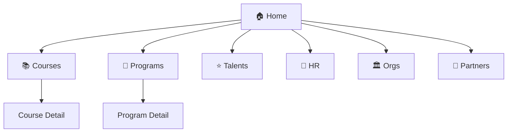

### 6.2 Authentication

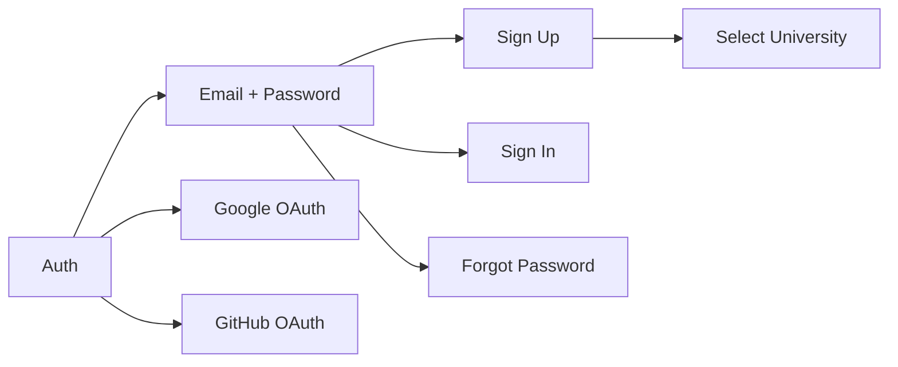

### 6.3 Online vs On-Site

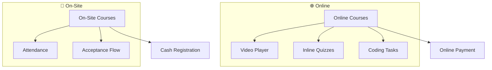

### 6.4 Student Profile Structure

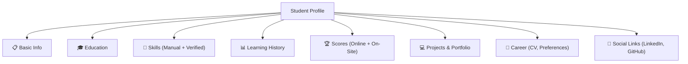

### 6.5 HR Module

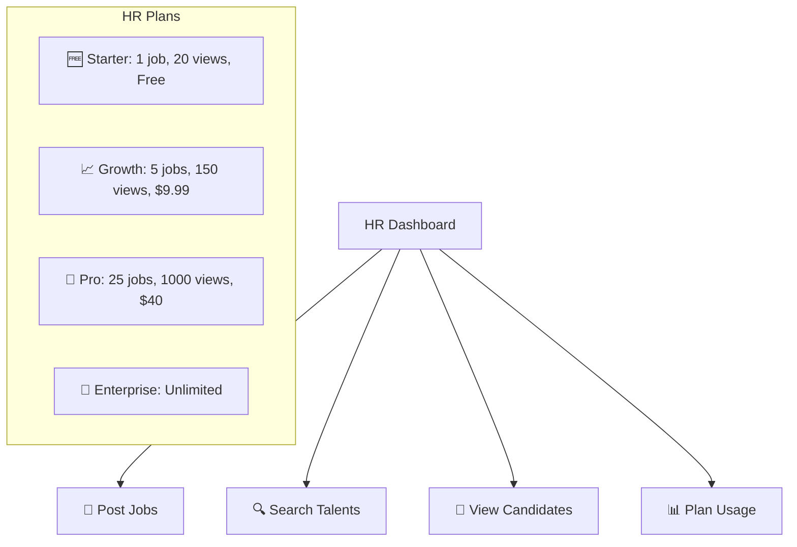

### 6.6 Organization Module

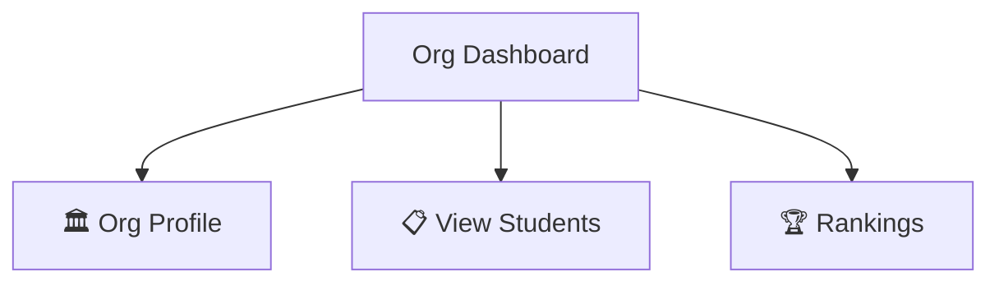

---

## 7. Page Map & Routes

### Public Pages

| Route | Page |
|-------|------|
| `/` | Home |
| `/courses` | Course Listing (with filters) |
| `/courses/{slug}` | Course Detail |
| `/programs` | Programs (slide showcase) |
| `/programs/{slug}` | Program Detail |
| `/talents` | Academy Talents |
| `/hr` | HR Landing |
| `/organizations` | Org Landing |
| `/about` | About |
| `/contact` | Contact |
| `/login` | Login |
| `/register` | Register |

### Student Pages (Auth)

| Route | Page |
|-------|------|
| `/dashboard` | Student Dashboard |
| `/profile` | Profile (edit) |
| `/profile/{id}` | Profile (public view) |
| `/my-courses` | Enrolled Courses |
| `/my-programs` | Enrolled Programs |
| `/learn/course/{slug}` | Learning View |
| `/learn/program/{slug}` | Program Learning View |
| `/certificates` | My Certificates |
| `/checkout/{type}/{id}` | Checkout |
| `/notifications` | Notifications |

### HR Pages (Auth + HR Role)

| Route | Page |
|-------|------|
| `/hr/dashboard` | HR Dashboard |
| `/hr/profile` | HR Profile |
| `/hr/jobs` | My Jobs |
| `/hr/jobs/create` | Post Job |
| `/hr/jobs/{id}` | Job Detail + Applications |
| `/hr/search` | Search Talents |
| `/hr/candidates/{id}` | Candidate Profile |
| `/hr/plans` | Plans & Subscription |

### Organization Pages (Auth + Org Role)

| Route | Page |
|-------|------|
| `/org/dashboard` | Org Dashboard |
| `/org/profile` | Org Profile |
| `/org/students` | My Students |
| `/org/rankings` | Rankings |

### Admin Panel (Filament)

| Route | Resource |
|-------|----------|
| `/admin` | Dashboard |
| `/admin/users` | Users |
| `/admin/courses` | Courses |
| `/admin/programs` | Programs |
| `/admin/categories` | Categories |
| `/admin/quizzes` | Quizzes |
| `/admin/enrollments` | Enrollments |
| `/admin/payments` | Payments |
| `/admin/certificates` | Certificates |
| `/admin/jobs` | Jobs |
| `/admin/hr-plans` | HR Plans |
| `/admin/organizations` | Organizations |
| `/admin/partners` | Partners |
| `/admin/settings` | Settings |

---

## 8. User Flows

### 8.1 Online Purchase

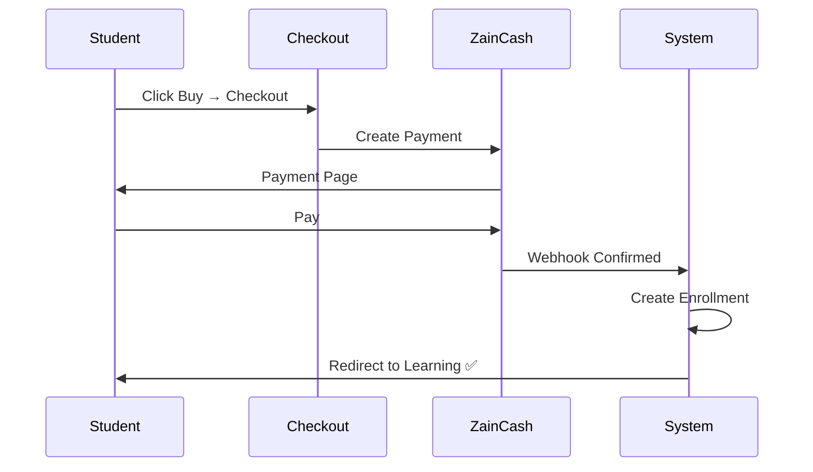

### 8.2 On-Site Registration

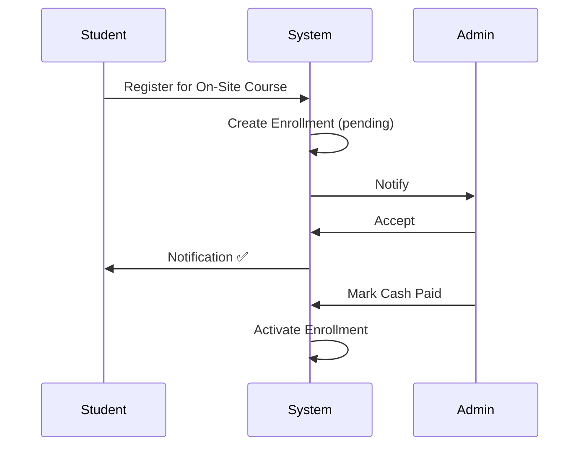

### 8.3 Role Switching

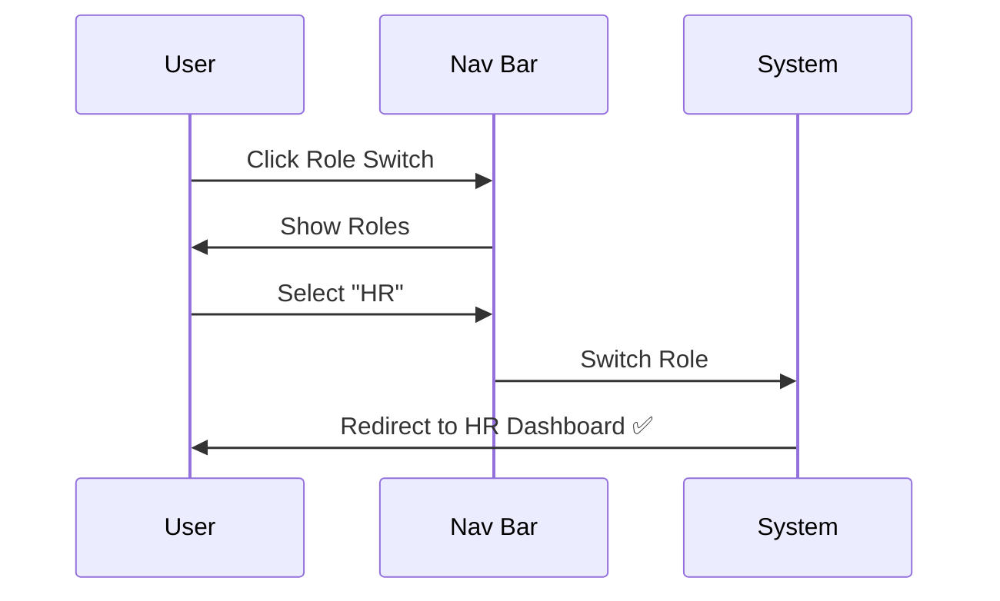

---

## 9. API Structure

```
/api
├── /auth
│   ├── POST   /register
│   ├── POST   /login
│   ├── POST   /logout
│   ├── POST   /forgot-password
│   ├── GET    /user
│   ├── POST   /google/callback
│   ├── POST   /github/callback
│   └── POST   /switch-role
│
├── /courses
│   ├── GET    /
│   ├── GET    /{slug}
│   ├── GET    /{slug}/lessons
│   └── GET    /categories
│
├── /programs
│   ├── GET    /
│   ├── GET    /{slug}
│   └── GET    /{slug}/courses
│
├── /enrollments (auth: student)
│   ├── GET    /
│   ├── POST   /
│   └── GET    /{id}/progress
│
├── /payments (auth)
│   ├── POST   /checkout
│   ├── POST   /webhook/zaincash
│   └── GET    /history
│
├── /quizzes (auth: student)
│   ├── GET    /{id}
│   ├── POST   /{id}/attempt
│   └── POST   /{id}/submit
│
├── /coding (auth: student)
│   ├── GET    /{id}
│   └── POST   /{id}/submit
│
├── /profile (auth)
│   ├── GET    /
│   ├── PUT    /
│   ├── POST   /skills
│   └── POST   /projects
│
├── /comments (auth: student)
│   ├── GET    /{type}/{id}
│   ├── POST   /
│   └── DELETE /{id}
│
├── /certificates (auth: student)
│   ├── GET    /
│   └── GET    /{id}/download
│
├── /notifications (auth)
│   ├── GET    /
│   └── PUT    /{id}/read
│
├── /hr (auth: hr)
│   ├── GET    /dashboard
│   ├── CRUD   /jobs
│   ├── GET    /jobs/{id}/applications
│   ├── GET    /search
│   ├── GET    /candidates/{id}
│   ├── GET    /plans
│   └── POST   /plans/{id}/subscribe
│
├── /org (auth: org)
│   ├── GET    /dashboard
│   ├── GET    /students
│   └── GET    /rankings
│
└── /search
    └── GET    /
```

---

## 10. Frontend Architecture (React)

```
resources/js/react/
├── index.tsx
├── App.tsx
├── index.css
├── types.ts
├── constants.ts
│
├── components/
│   ├── common/         (Navbar, Footer, Sidebar, Modal, RoleSwitcher)
│   ├── auth/           (LoginForm, RegisterForm, SocialLoginButtons)
│   ├── courses/        (CourseCard, CourseList, CourseDetail, LessonPlayer)
│   ├── programs/       (ProgramCard, ProgramSlider, ProgramDetail)
│   ├── student/        (Dashboard, ProfileEditor, LearningView, ProgressTracker)
│   ├── quizzes/        (QuizPlayer, QuestionCard, QuizResults)
│   ├── coding/         (CodeEditor, TestCaseRunner, SubmissionResults)
│   ├── hr/             (HRDashboard, JobForm, TalentSearch, CandidateProfile)
│   ├── org/            (OrgDashboard, StudentList, Rankings)
│   ├── checkout/       (CheckoutPage, OrderSummary, PaymentForm)
│   └── landing/        (Hero, FeaturedCourses, CertPartners)
│
├── contexts/           (AuthContext, NotificationContext)
├── hooks/              (useAuth, useRole, useCourses, usePrograms)
├── services/           (api, authService, courseService, paymentService, hrService)
└── utils/              (formatters, validators, roleGuard)
```

---

## 11. Admin Panel (Filament)

```
app/Filament/
├── Resources/
│   ├── UserResource.php
│   ├── CourseResource.php
│   ├── ProgramResource.php
│   ├── CategoryResource.php
│   ├── InstructorResource.php
│   ├── EnrollmentResource.php
│   ├── PaymentResource.php
│   ├── QuizResource.php
│   ├── CodingTaskResource.php
│   ├── CertificateResource.php
│   ├── JobResource.php
│   ├── HRPlanResource.php
│   ├── OrganizationResource.php
│   ├── CertificationPartnerResource.php
│   ├── CommentResource.php
│   └── SettingResource.php
│
├── Widgets/
│   ├── StatsOverview.php
│   └── RevenueChart.php
│
└── Pages/
    └── Dashboard.php
```

---

## 12. Payment & Checkout Architecture

### Payment Flows

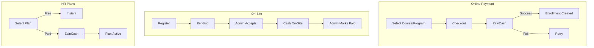

### HR Plans

| Plan | Jobs | Search | Views | Price |
|------|------|--------|-------|-------|
| 🆓 Starter | 1/mo | Basic | 20/mo | Free |
| 📈 Growth | 5/mo | Advanced | 150/mo | $9.99 |
| 🚀 Pro | 25/mo | Advanced | 1,000/mo | $40 |
| 🏢 Enterprise | Unlimited | Custom | Unlimited | Contact |

---

## 13. Integrations

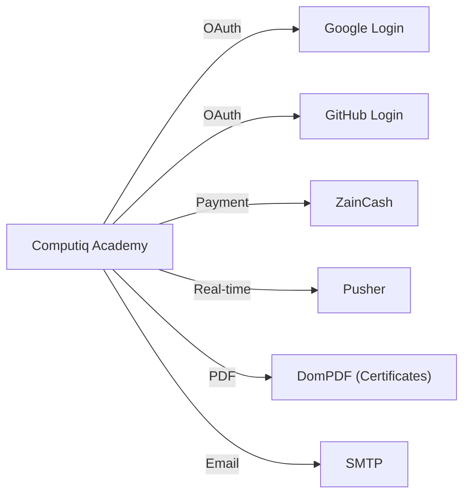

### Real-time Events (Pusher)

| Event | Channel |
|-------|---------|
| New notification | `private-user.{id}` |
| Payment confirmed | `private-user.{id}` |
| New job application | `private-hr.{id}` |

---

## 14. V1 Task Tracker

### Core Platform

| # | Task | Priority |
|---|------|----------|
| 1 | Build academy public pages (home, courses, programs, talents, HR, org) | 🔴 High |
| 2 | Build authentication (email/password, Google, GitHub) | 🔴 High |
| 3 | Build role-based access for 4 roles | 🔴 High |
| 4 | Build role switching | 🔴 High |
| 5 | Build payment & checkout (online ZainCash + on-site cash) | 🔴 High |
| 6.1 | Build programs slide-style showcase | 🟡 Medium |
| 6.2 | Build certification partner section | 🟡 Medium |
| 6.3 | Build skill finder map | 🟡 Medium |
| 6.4 | Build Arabic (RTL) localization & UI support | 🔴 High |
| 7 | Build content access after payment | 🔴 High |
| 8 | Build search with filtering and categories | 🟡 Medium |
| 9 | Build online vs on-site clear separation | 🔴 High |

### Student

| # | Task | Priority |
|---|------|----------|
| 10 | Build student dashboard | 🔴 High |
| 11 | Build student learning view (programs-centered) | 🔴 High |
| 13 | Build course + program detail & payment pages | 🔴 High |
| 14 | Build student profile (LinkedIn-ready) | 🔴 High |
| 15 | Build comments & ratings | 🟡 Medium |
| 16 | Build attendance status (on-site) | 🟡 Medium |
| 17 | Build quizzes inside learning flow | 🔴 High |
| 18 | Build coding assessments with test cases | 🔴 High |
| 19 | Build standalone exams | 🟡 Medium |
| 20 | Build certificates | 🟡 Medium |
| 21 | Build AI guidance chatbot | 🟡 Medium |
| 22 | Build community basics | 🟢 Low |
| 23 | Build retention features (notifications, reminders) | 🟢 Low |
| 24 | Build student recognition (later phase) | 🟢 Low |

### HR

| # | Task | Priority |
|---|------|----------|
| 25 | Build HR job posting & application flow | 🔴 High |
| 26 | Build HR dashboard | 🔴 High |
| 27 | Build talent search & filtering | 🔴 High |
| 28 | Build candidate profile views | 🟡 Medium |
| 29 | Build HR plans (Starter/Growth/Pro/Enterprise) | 🔴 High |
| 30 | Build HR profile | 🟡 Medium |

### Organization

| # | Task | Priority |
|---|------|----------|
| 31 | Build organization registration & profile | 🟡 Medium |
| 32 | Build organization dashboard | 🟡 Medium |
| 33 | Build organization-linked student visibility | 🟡 Medium |

> **Total V1 Tasks: 35**

---

## 15. Deferred to V2

The following features are planned but **not included in V1** to ensure a faster launch:

| Feature | Why Deferred |
|---------|-------------|
| Instructor role & dashboard | Admin manages content in V1; instructor self-service in V2 |
| Gamification (XP, levels, badges, leaderboards) | Engagement feature, not core |
| Learning paths | Requires extensive content first |
| Mentorship sessions | Complex booking system |
| Coupon & discount system | Can process discounts manually in V1 |
| Refund system | Handle refunds manually via admin in V1 |
| Content protection (DRM, watermarking) | Basic signed URLs sufficient for V1 |
| Waitlists for on-site courses | Manual management in V1 |
| Student testimonials | Collect manually in V1 |
| Organization-sponsored enrollments | Manual enrollment by admin in V1 |
| Admin analytics dashboard | Basic Filament stats widgets sufficient |
| Two-factor authentication | Standard auth sufficient for V1 |
| Partnership portal for cert bodies | Manual management in V1 |
| Mobile PWA / offline access | Responsive design sufficient for V1 |

---

> **Last updated:** March 17, 2026  
> **Project:** Computiq Academy  
> **Scope:** V1 — MVP Launch (35 tasks)
