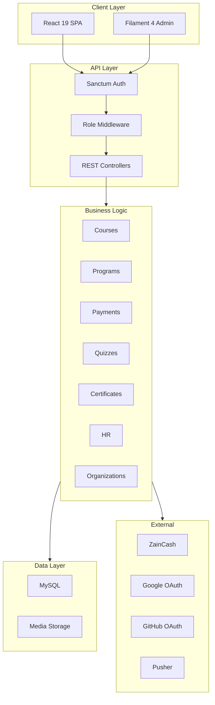
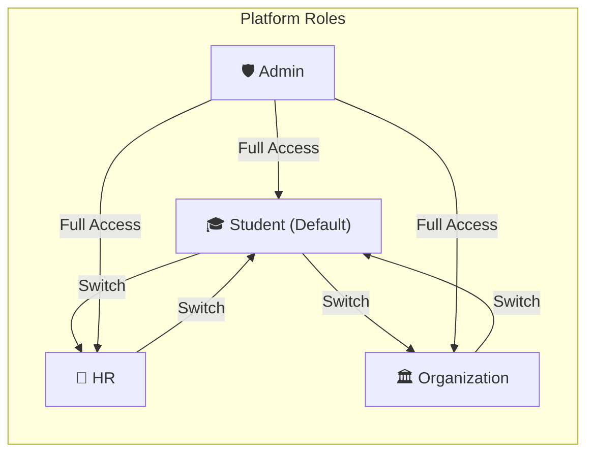
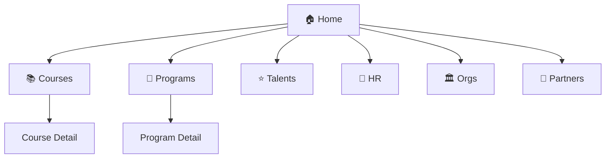
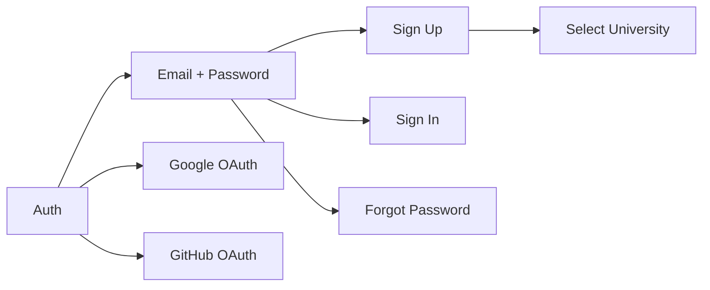
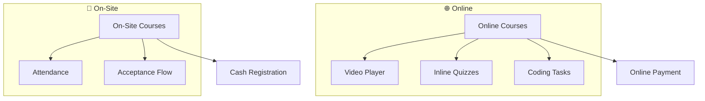
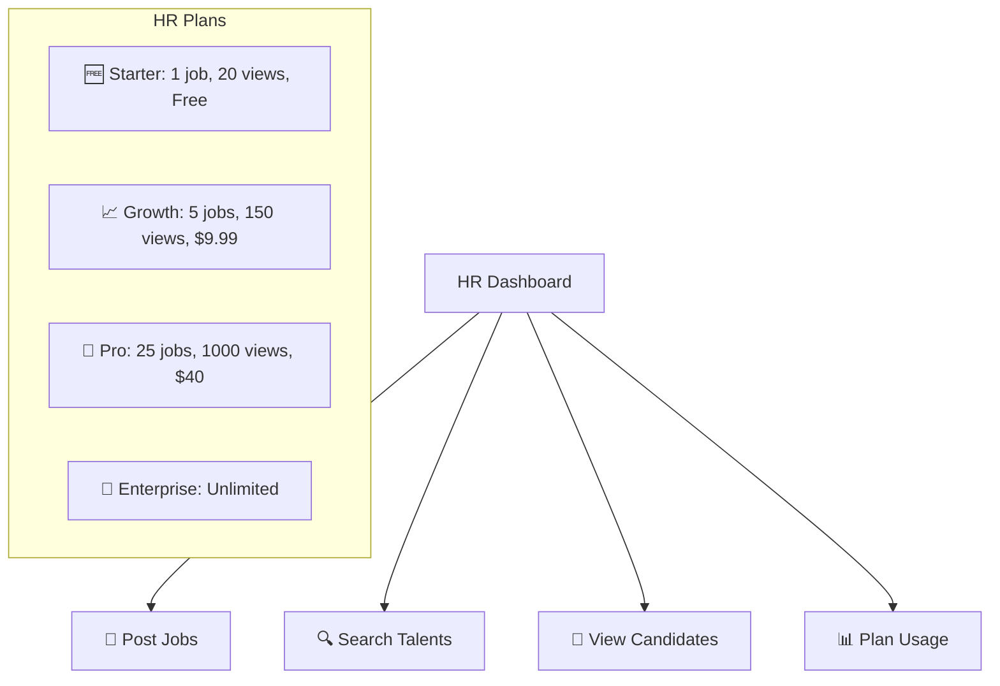
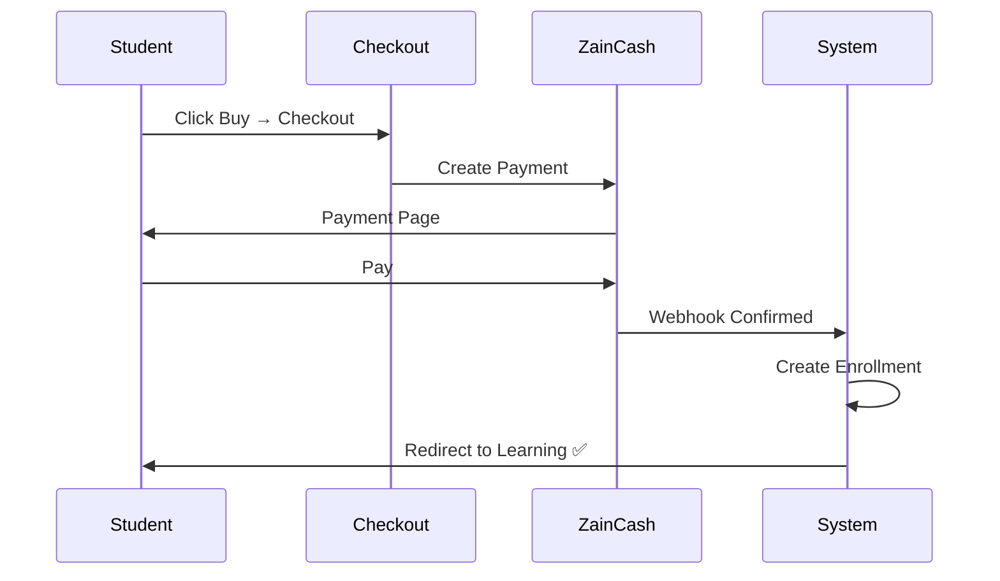
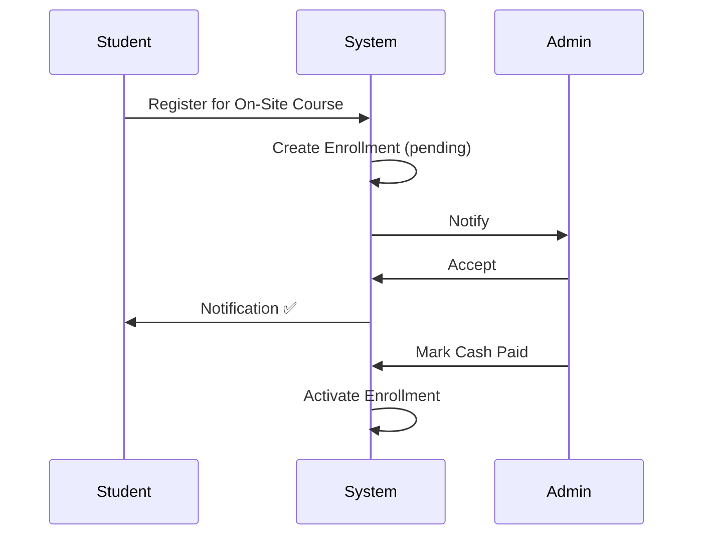

# أكاديمية كمبيوتك — تصميم معمارية المشروع (الإصدار 1)

> **الإصدار:** 1.0 — الإطلاق الأولي (MVP)  
> **التاريخ:** 17 مارس 2026  
> **التقنيات:** Laravel 12 · Filament 4 · React 19 · Tailwind CSS 4 · MySQL · Vite

---

## جدول المحتويات

1. [نظرة عامة على المشروع](#1-نظرة-عامة-على-المشروع)
2. [التقنيات المستخدمة (Tech Stack)](#2-التقنيات-المستخدمة-tech-stack)
3. [البنية الهيكلية العامة (Architecture)](#3-البنية-الهيكلية-العامة-architecture)
4. [نظام الأدوار وصلاحيات الوصول](#4-نظام-الأدوار-وصلاحيات-الوصول)
5. [مخطط قاعدة البيانات (Database Schema)](#5-مخطط-قاعدة-البيانات-database-schema)
6. [تفاصيل الوحدات الأساسية (Core Modules)](#6-تفاصيل-الوحدات-الأساسية-core-modules)
7. [خريطة الصفحات والمسارات (Page Map & Routes)](#7-خريطة-الصفحات-والمسارات-page-map--routes)
8. [تدفق المستخدمين (User Flows)](#8-تدفق-المستخدمين-user-flows)
9. [هيكلية واجهة برمجة التطبيقات (API)](#9-هيكلية-واجهة-برمجة-التطبيقات-api)
10. [معمارية واجهة المستخدم (React)](#10-معمارية-واجهة-المستخدم-react)
11. [لوحة تحكم الإدارة (Filament)](#11-لوحة-تحكم-الإدارة-filament)
12. [معمارية الدفع (Payment)](#12-معمارية-الدفع-payment)
13. [عمليات الربط (Integrations)](#13-عمليات-الربط-integrations)
14. [متتبع المهام للإصدار الأول (V1 Tasks)](#14-متتبع-المهام-للإصدار-الأول-v1-tasks)
15. [مؤجل للإصدار الثاني (Deferred to V2)](#15-مؤجل-للإصدار-الثاني-deferred-to-v2)

---

## 1. نظرة عامة على المشروع

**أكاديمية كمبيوتك** هي منصة تعليم إلكتروني للسوق العراقي تدعم:

- الدورات والبرامج **الإلكترونية والحضورية**
- **أربعة أدوار**: الطالب، الموارد البشرية (HR)، المؤسسة، المشرف (Admin)
- **ميزة تبديل الأدوار** (مستوحاة من [eYouth](https://eyouthlearning.com/ar/))
- **الدفع الإلكتروني** (ZainCash) والدفع النقدي (للحضوري)
- **مجمع المواهب** للتوظيف عبر مسؤولي الموارد البشرية
- **لوحات تحكم** للجامعات لمتابعة الطلاب

### الأهداف الرئيسية

| الهدف | الوصف |
|------|-------------|
| **التعليم** | توفير تعليم متكامل (دورات وبرامج) |
| **التوظيف** | ربط الخريجين مع الشركات عبر منصة المواهب |
| **الشراكات** | تمكين الجامعات من تقييم أداء طلابها |
| **الإيرادات** | مبيعات الدورات/البرامج + اشتراكات باقات HR |

---

## 2. التقنيات المستخدمة (Tech Stack)

### الواجهة الخلفية (Backend)

| الطبقة | التقنية |
|-------|-----------|
| إطار العمل | Laravel 12 |
| لوحة التحكم | Filament 4 |
| المصادقة | Laravel Sanctum + Socialite (Google, GitHub) |
| الأدوار | Spatie Laravel Permission |
| إدارة الملفات | Spatie Media Library |
| بوابات الدفع | ZainCash |
| التصدير | DomPDF, Maatwebsite Excel |
| الإشعارات الحية | Pusher + Laravel Echo |

### الواجهة الأمامية (Frontend)

| الطبقة | التقنية |
|-------|-----------|
| إطار الواجهة | React 19 (TSX) |
| التوجيه | React Router DOM v7 |
| التصميم | Tailwind CSS 4 |
| طلبات الشبكة | Axios |
| التنبيهات | React Toastify |
| الأيقونات | Lucide React |
| تجميع الكود | Vite 7 |

---

## 3. البنية الهيكلية العامة (Architecture)

---

## 4. نظام الأدوار وصلاحيات الوصول

### 4.1 نظرة عامة على الأدوار

### 4.2 تبديل الأدوار

يمكن للمستخدمين التبديل عبر زر القائمة العلوية. جميع المستخدمين يبدأون بدور **طالب (Student)**. الأدوار الإضافية يتم تفعيلها بعد إكمال الملف التعريفي الخاص بالدور.

### 4.3 جدول الصلاحيات

| الميزة | الطالب | HR | المؤسسة | المشرف |
|---------|---------|-----|-------------|-------|
| تصفح المنصة | ✅ | ✅ | ✅ | ✅ |
| شراء الدورات/البرامج | ✅ | — | — | — |
| مشاهدة الدروس/التعلم| ✅ | — | — | ✅ |
| حل الاختبارات | ✅ | — | — | — |
| إصدار الشهادات | ✅ | — | — | — |
| التعليق والتقييم | ✅ | — | — | — |
| نشر الوظائف | — | ✅ | — | ✅ |
| البحث في مجمع المواهب| — | ✅ | — | ✅ |
| رؤية ملف الطالب | — | ✅ | — | ✅ |
| رؤية طلاب المؤسسة | — | — | ✅ | ✅ |
| إدارة النظام بالكامل | — | — | — | ✅ |

---

## 5. مخطط قاعدة البيانات (Database Schema)

### 5.1 مخطط الروابط (ERD)

```mermaid
erDiagram
    USERS ||--o{ ENROLLMENTS : "enrolls in"
    USERS ||--o{ PAYMENTS : "makes"
    USERS ||--o{ COMMENTS : "writes"
    USERS ||--o{ CERTIFICATES : "earns"
    USERS ||--o{ QUIZ_ATTEMPTS : "takes"
    USERS ||--o{ CODING_SUBMISSIONS : "submits"
    USERS ||--o{ JOB_APPLICATIONS : "applies to"
    USERS ||--o{ USER_SKILLS : "has"
    USERS }o--o| ORGANIZATIONS : "belongs to"
    USERS }o--o| STUDENT_PROFILES : "has"
    USERS }o--o| HR_PROFILES : "has"

    COURSES ||--o{ LESSONS : "contains"
    COURSES ||--o{ QUIZZES : "includes"
    COURSES ||--o{ CODING_TASKS : "includes"
    COURSES ||--o{ ENROLLMENTS : "has"
    COURSES ||--o{ COMMENTS : "receives"
    COURSES }o--|| INSTRUCTORS : "taught by"
    COURSES }o--o| CATEGORIES : "categorized in"
    COURSES ||--o{ ATTENDANCE_RECORDS : "tracks"

    PROGRAMS ||--o{ PROGRAM_COURSES : "contains"
    PROGRAMS ||--o{ ENROLLMENTS : "has"
    PROGRAMS ||--o{ COMMENTS : "receives"
    PROGRAMS }o--o| CERTIFICATION_PARTNERS : "partnered with"

    QUIZZES ||--o{ QUIZ_QUESTIONS : "contains"
    QUIZ_ATTEMPTS ||--o{ QUIZ_ANSWERS : "contains"

    CODING_TASKS ||--o{ TEST_CASES : "validated by"

    HR_PROFILES ||--o{ JOBS : "posts"
    HR_PROFILES }o--|| HR_PLANS : "subscribed to"
    JOBS ||--o{ JOB_APPLICATIONS : "receives"
```

*(الجداول التفصيلية موجودة في النسخة الإنجليزية - يرجى الرجوع لـ PROJECT_DESIGN.md لمعاينة أسماء الأعمدة وقواعد البيانات)*

---

## 6. تفاصيل الوحدات الأساسية

### 6.1 صفحات الأكاديمية العامة

### 6.2 المصادقة والتسجيل

### 6.3 الإلكتروني مقابل الحضوري

### 6.4 منصة الموارد البشرية

---

## 7. خريطة الصفحات والمسارات (Routes)

يحتوي الإصدار الأول على أكثر من 30 مساراً لصفحات المنصة.
أهمها: `/courses`, `/programs`, `/dashboard`, `/learn`, وغيرها من مسارات لوحة المشرف (`/admin`).

---

## 8. تدفق المستخمين (User Flows)

### 8.1 الدفع الإلكتروني

### 8.2 التسجيل الحضوري

---

## 14. متتبع المهام للإصدار الأول (V1 Tasks)

### المنصة الأساسية

| # | المهمة | الأولوية |
|---|------|----------|
| 1 | بناء الصفحات العامة | 🔴 High |
| 2 | المصادقة (إيميل، جوجل، جيت هب) | 🔴 High |
| 3 | صلاحيات الأدوار الأربعة | 🔴 High |
| 4 | التبديل بين الأدوار | 🔴 High |
| 5 | الدفع الإلكتروني والنقدي للحضوري | 🔴 High |
| 6.1 | معرض البرامج | 🟡 Medium |
| 6.2 | قسم الشركاء | 🟡 Medium |
| 6.3 | خريطة المواهب (Skill Finder) | 🟡 Medium |
| 6.4 | دعم اللغة العربية وتغيير اتجاه العرض للـ RTL | 🔴 High |
| 7 | فتح المحتوى بعد الدفع | 🔴 High |
| 8 | البحث والتصنيفات | 🟡 Medium |
| 9 | الفصل بين الحضوري والإلكتروني | 🔴 High |

### الطالب

| # | المهمة | الأولوية |
|---|------|----------|
| 10 | لوحة تحكم الطالب | 🔴 High |
| 11 | مساحة دراسة البرامج | 🔴 High |
| 13 | صفحات الدورة والتفاصيل | 🔴 High |
| 14 | ملف الطالب (موجه لعمليات التوظيف) | 🔴 High |
| 15 | التقييمات والتعليقات | 🟡 Medium |
| 16 | تسجيل الحضور (للحضوري) | 🟡 Medium |
| 17 | الاختبارات التقيمية بالفيديوهات | 🔴 High |
| 18 | التحديات البرمجية | 🔴 High |
| 19 | الامتحانات المستقلة للشهادات المباشرة | 🟡 Medium |
| 20 | الشهادات | 🟡 Medium |
| 21 | مساعد الذكاء الاصطناعي (Chatbot) | 🟡 Medium |
| 22 | مساحة المجتمع والنقاش (Community) | 🟢 Low |
| 23 | إشعارات الاستمرارية والعودة (Retention) | 🟢 Low |
| 24 | تمييز الطلاب المتفوقين | 🟢 Low |

### الموارد البشرية والجامعات

(المهام 25 إلى 33 موجهة لتطوير لوحات تحكم الجامعات والمؤسسات ومعارض التوظيف، الأولوية عالية).

> **المجموع الكلي للمهام للإصدار الأول: 35 مهمة برمجية وتنفيذية.**

---

*(يُرجى الرجوع لملف `PROJECT_DESIGN.md` باللغة الإنجليزية للأكواد والبنية المعمارية للملفات والمجلدات وتفاصيل الداتابيز API)*

---

> **آخر تحديث:** 17 مارس 2026  
> **لـ:** أكاديمية كمبيوتك  
> **الإصدار:** V1 (35 مهمة عمل)
